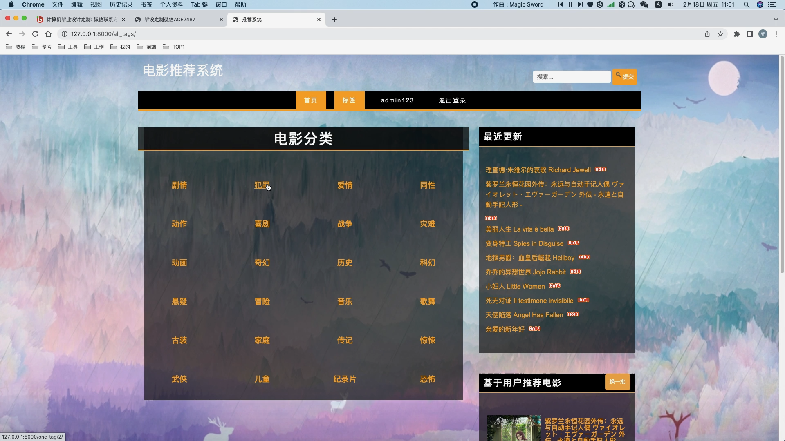

## 计算机毕业设计Django+Vue.js电影推荐系统 电影用户画像系统 电影可视化 电影大数据 机器学习 深度学习 知识图谱 Hadoop Spark

## 要求
### 源码有偿！一套(论文 PPT 源码+sql脚本+教程)

### 
### 加好友前帮忙start一下，并备注github有偿纯python电影推荐
### 我的QQ号是2827724252或者798059319或者 1679232425或者微信:bysj2023nb 或bysj1688

# 

### 加qq好友说明（被部分 网友整得心力交瘁）：
    1.加好友务必按照格式备注
    2.避免浪费各自的时间！
    3.当“客服”不容易，repo 主是体面人，不爆粗，性格好，文明人。
	
	
python django javascript bootstrap jquery 协同过滤 推荐算法 机器学习
影片显示、影片分类显示、热门影片排序显示、收藏影片排序显示、
时间排序显示、评分排序显示、算法推荐、影片搜索、影片信息管理

演示视频
https://www.bilibili.com/video/BV1TS411w7Db/?spm_id_from=333.999.0.0

